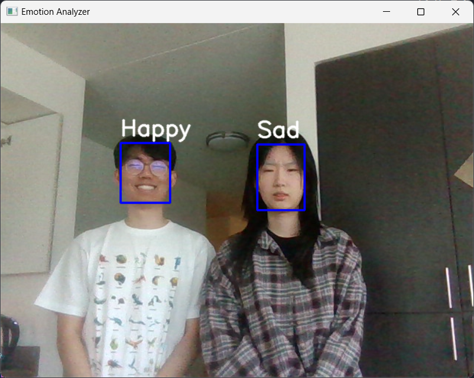
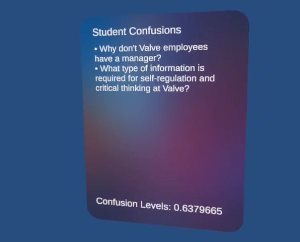

# AR-student-emotion-analyzer
Understanding where students struggle is crucial in providing a good educational experience,
yet many students suffer in silence, making it difficult for instructors to adjust.

We propose a real-time system that integrates facial emotion classification, speech-to-text transcription, and augmented reality to provide instructors with immediate feedback during live lectures when students are confused. 

## implementation
</img>
</img>
</img>
## server setup
`pip install -r ./requirements.txt`

## unity setup
- Set up Meta Quest settings
- Set up ngrok domain and change serverUrl in SocketManager.cs

## resources + references
- YOLO for face detection: https://github.com/akanametov/yolo-face?tab=readme-ov-file
- Pre-trained emotion detection model: https://github.com/atulapra/Emotion-detection
- Live transcription with Whisper: https://github.com/gaborvecsei/whisper-live-transcription
- Unity UI tutorial: https://www.youtube.com/watch?v=XOc71-Og0Kg
